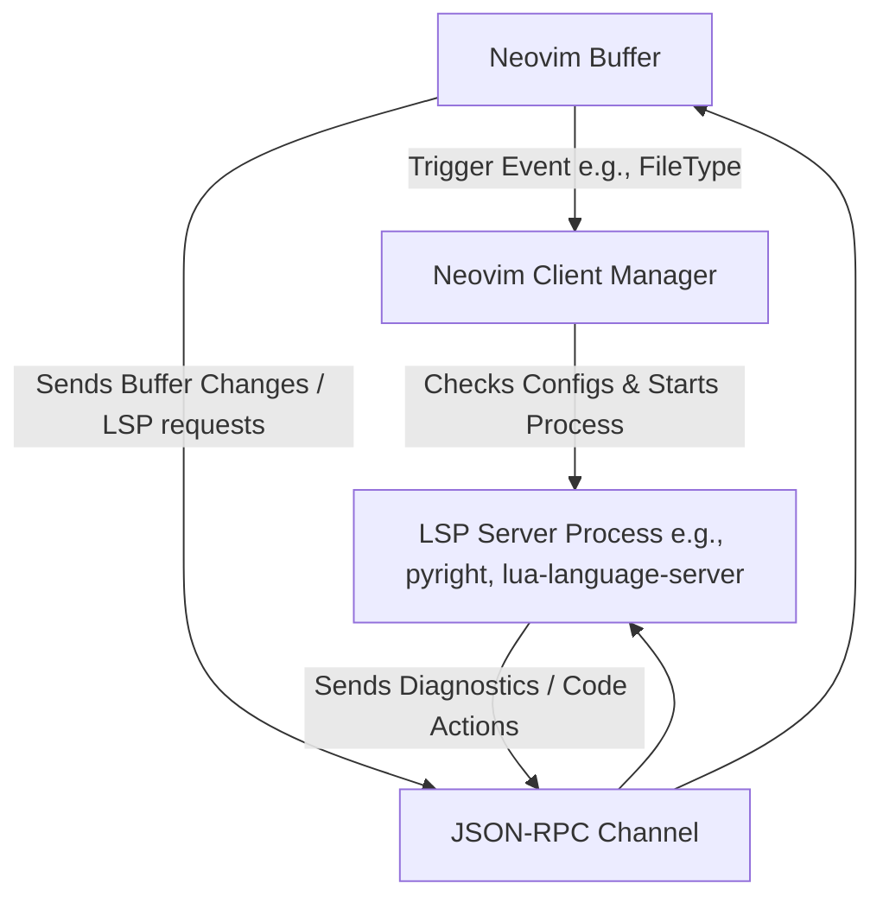
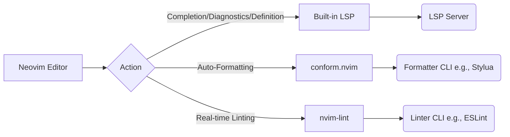

# Neovim LSP, Formatting, & Linting Architecture

This document outlines the architecture, native low-level APIs, surrounding plugins, and standard formatting/linting patterns for modern Neovim (**0.11+**).

---

## 1. Neovim's Native LSP Architecture

At its core, Neovim acts as an **LSP client**. It communicates with external **LSP servers** (running as separate background processes on your machine) via standard JSON-RPC over stdin/stdout.



Historically, setups relied heavily on heavy orchestration plugins (`nvim-lspconfig`). In Neovim 0.11+, language servers are configured and loaded using **first-class native APIs** built directly into the core editor.

---

## 2. Low-Level Native APIs

These are the primitive functions provided natively by Neovim to initialize, hook into, and trigger LSP interactions without requiring external plugins:

### A. Launching & Attaching: `vim.lsp.start`
This function is the primary low-level gateway. When called inside a buffer, it checks if a client matching the server `name` and `root_dir` is already running. If so, it attaches the current buffer to it; if not, it spawns a new server process.

```lua
-- Minimal manual lua_ls setup using only vim.lsp.start
vim.api.nvim_create_autocmd("FileType", {
  pattern = "lua",
  callback = function()
    vim.lsp.start({
      name = "lua_ls",
      cmd = { "lua-language-server" },
      root_dir = vim.fs.root(0, { ".luarc.json", ".git" }),
      settings = {
        Lua = { diagnostics = { globals = { "vim" } } }
      }
    })
  end,
})
```

### B. The Modern 0.11+ Declarative APIs: `vim.lsp.config` & `vim.lsp.enable`
Neovim 0.11+ splits LSP management into two steps:
1. **Registration**: `vim.lsp.config(name, config)` maps a server name to its startup settings. (Neovim loads these automatically if placed inside `~/.config/nvim/lsp/<server_name>.lua`).
2. **Activation**: Calling `vim.lsp.enable(name)` starts the server automatically whenever you open matching file types.

```lua
-- In init.lua: Enable lua_ls using native 0.11 declarations
vim.lsp.enable("lua_ls")
```

### C. Binding Interactions: The `LspAttach` Event
Instead of the deprecated `on_attach` callback option, you should use the global `LspAttach` autocommand. This fires whenever an LSP client binds to a buffer, making it the perfect place to set buffer-local keymaps:

```lua
vim.api.nvim_create_autocmd("LspAttach", {
  callback = function(event)
    local opts = { buffer = event.buf }
    -- Jump to definition
    vim.keymap.set("n", "gd", vim.lsp.buf.definition, opts)
    -- Display hover information
    vim.keymap.set("n", "K", vim.lsp.buf.hover, opts)
    -- Rename variable symbols
    vim.keymap.set("n", "<leader>rn", vim.lsp.buf.rename, opts)
    -- Display list of code actions
    vim.keymap.set("n", "<leader>ca", vim.lsp.buf.code_action, opts)
  end,
})
```

### D. Core Interaction Methods
*   **`vim.lsp.buf.definition()`**: Queries the server for the URI/range of a symbol's definition.
*   **`vim.lsp.buf.references()`**: Retrieves all usages of the symbol under the cursor.
*   **`vim.diagnostic.config()`**: Controls visual diagnostics (virtual text, underlines, signs, and floating windows).

---

## 3. The Surrounding Plugin Ecosystem

While the client is native, standard plugins serve as helper layers:
*   **`neovim/nvim-lspconfig`**: A community repository of pre-written configuration templates for hundreds of language servers. You use it to avoid writing the `cmd` and initialization settings manually for every language.
*   **`williamboman/mason.nvim`**: A package manager interface to download and install LSP servers, formatters, and linters into your local system (`~/.local/share/nvim/mason`).
*   **`williamboman/mason-lspconfig.nvim`**: Hooks Mason into `lspconfig` so that Neovim automatically maps installed binaries to their configurations.
*   **`saghen/blink.cmp`** (or `nvim-cmp`): Connects to the LSP server to pull in completions. It requires feeding its "capabilities" configuration into the LSP server initialization so the server knows it is allowed to send rich completion payloads.

---

## 4. Linters & Formatters (The Modern Way)

In the past, users forced linters and formatters through the LSP loop using plugins like `null-ls` (now `none-ls`). Doing this forced CLI scripts to pretend to be language servers, leading to slow performance.

Today's best practice is to **separate concerns**:



### Formatting: `stevearc/conform.nvim`
Runs CLI formatters (like `stylua`, `black`, or `prettier`) asynchronously when you write files. It falls back to LSP formatting (`lsp_format = "fallback"`) only if a dedicated CLI tool is not configured.
```lua
-- Sample conform configuration
require("conform").setup({
  formatters_by_ft = {
    lua = { "stylua" },
    python = { "black", "isort" },
  },
  format_on_save = { timeout_ms = 500, lsp_format = "fallback" }
})
```

### Linting: `mfussenegger/nvim-lint`
Hooks directly into Neovim's diagnostic subsystem. It calls external linting tools (like `eslint_d`, `shellcheck`, or `ruff`) on specific buffers during event triggers like saving or exiting insert mode:
```lua
-- Sample nvim-lint configuration
local lint = require("lint")
lint.linters_by_ft = {
  javascript = { "eslint_d" },
}
vim.api.nvim_create_autocmd({ "BufWritePost" }, {
  callback = function() lint.try_lint() end,
})
```
