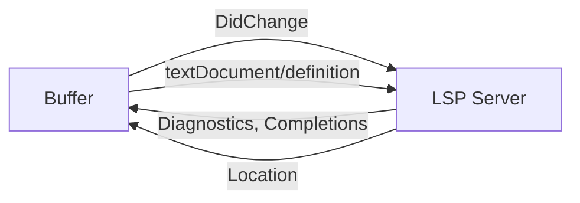

# LSP, Linters & Formatters: Capabilities Reference

## Why Three Separate Systems?

| Tool | Domain | What it does |
|---|---|---|
| **LSP server** | Language intelligence | Smart rename, go-to-def, completion, diagnostics |
| **Linter** (e.g. ruff, eslint) | Rule enforcement | Catches what the LSP doesn't: style, security, complexity |
| **Formatter** (e.g. prettier, stylua) | Code shape | Rewrites whitespace/indentation/line breaks to a standard |

They overlap at *diagnostics* — both LSP and linters can report errors/warnings — but LSP is weaker at project-specific rules and formatters do not diagnose at all.

---

## 1. LSP — Language Server Protocol

### What it is

A standard protocol for a background server process to provide language intelligence to any editor. Neovim is the **LSP client**; the server (e.g. `basedpyright`, `rust-analyzer`, `clangd`) is a separate binary.



### Universal features (every LSP server implements these)

These are defined in the LSP spec. Every compliant server supports them, though quality varies.

| Feature | Request | Keybind | What it does |
|---|---|---|---|
| **Go to definition** | `textDocument/definition` | `gd` | Jump to where a symbol is defined |
| **Find references** | `textDocument/references` | `gr` | List every place a symbol is used (project-wide) |
| **Hover** | `textDocument/hover` | `K` | Show type signature, docstring, and docs in a popup |
| **Completion** | `textDocument/completion` | (auto) | Show context-aware completions as you type |
| **Diagnostics** | `textDocument/publishDiagnostics` | (auto) | Errors, warnings, hints underlined in the buffer + sign column |
| **Signature help** | `textDocument/signatureHelp` | (auto) | Show parameter info when inside a function call |
| **Code action** | `textDocument/codeAction` | `<leader>ca` | Quick-fix suggestions (auto-import, add missing parameter, etc.) |
| **Rename** | `textDocument/rename` | `<leader>rn` | Rename a symbol project-wide — understands scope, avoids collisions |
| **Document symbols** | `textDocument/documentSymbol` | `:Telescope lsp_document_symbols` | List all functions, classes, variables in the current file |
| **Workspace symbols** | `textDocument/workspaceSymbol` | `:Telescope lsp_workspace_symbols` | Search for a symbol across the entire project |
| **Go to type definition** | `textDocument/typeDefinition` | — | Jump to where a type is defined (e.g. `str` → Rust's `std::primitive`) |
| **Go to implementation** | `textDocument/implementation` | — | Jump to the implementation of an interface/trait |
| **Document format** | `textDocument/formatting` | (auto) | Format the whole file |
| **Range format** | `textDocument/rangeFormatting` | (selection) | Format only the selected lines |
| **Folding ranges** | `textDocument/foldingRange` | (auto) | Enable code folding (`za`, `zM`, `zR`) |
| **Selection ranges** | `textDocument/selectionRange` | (auto) | Expand/shrink selection intelligently |
| **Semantic tokens** | `textDocument/semanticTokens` | (auto) | Syntax highlighting based on the server's AST (more accurate than treesitter for some languages) |

### Server-specific features (only some servers)

These are **optional** capabilities. Whether you get them depends on the server.

#### Inlay hints (`textDocument/inlayHints`)

Show inferred types inline without editing the buffer.

```
let x = 5;       →  let x: i32 = 5;     (hover-style hint)
let y = vec![];  →  let y: Vec<i32> = vec![];  (ghost text)
```

**Servers**: `rust-analyzer`, `basedpyright`, `gopls`, `typescript-language-server`, `lua-language-server`

```
:LspInlayHint toggle
```

#### Call hierarchy (`textDocument/prepareCallHierarchy`)

Show who calls this function, and which functions it calls.

```
:IncomingCalls   (who calls this?)
:OutgoingCalls   (what does this call?)
```

**Servers**: `typescript-language-server`, `rust-analyzer`, `clangd`, `gopls`

#### Type hierarchy (`textDocument/prepareTypeHierarchy`)

Navigate sub-types and super-types.

```
:SuperTypes      (parent class / interface)
:SubTypes        (implementations / subclasses)
```

**Servers**: `typescript-language-server`, `gopls`, `rust-analyzer` (partial)

#### Code lens (`textDocument/codeLens`)

Inline buttons at the top of functions (Run test | | Debug).

```rust
// [▶ Run test]    ← this is a code lens
#[test]
fn test_add() { ... }
```

**Servers**: `rust-analyzer`, `gopls`, `golangci-lint-ls`

#### Linked editing (`textDocument/linkedEditingRange`)

Edit matching pairs (HTML tags, Markdown link text/URL) simultaneously.

**Servers**: `vscode-html-language-server`

#### Color provider (`textDocument/colorProvider`)

Show a color picker inline for CSS color values.

**Servers**: `vscode-css-language-server`, `tailwindcss-language-server`

#### Monikers (`textDocument/moniker`)

Stable identifiers for symbols, used for refactoring across languages.

**Servers**: `rust-analyzer`, `csharp-language-server`

#### Workspace symbols with ranking

Some servers rank workspace symbol results for relevance.

**Servers**: `rust-analyzer` (uses `bm25` ranking), `clangd` (uses fuzzy match ranking)

---

## 2. Linters (`mfussenegger/nvim-lint`)

### What they are

Standalone CLI tools that analyse code for bugs, anti-patterns, and style violations. They run via `nvim-lint` and feed results into Neovim's diagnostic subsystem — the same place LSP diagnostics appear.

```
Setup:  nvim-lint  →  linter CLI (ruff, eslint)  →  Neovim diagnostics
```

### Why use a linter if you already have LSP?

LSP diagnostics are conservative — they flag things that definitely break the build. Linters enforce *opinions*:

| LSP catches | Linter catches |
|---|---|
| Syntax errors | Unused variables |
| Type errors | Missing docstrings |
| Import resolution failures | Line too long |
| Undefined symbols | Wrong naming convention |
| | Cyclomatic complexity |
| | Security vulns (eval, exec) |
| | Debug leftovers (console.log, pdb) |

### Example linters by filetype

| Language | Linter | Typical rules |
|---|---|---|
| Python | `ruff` | Unused import, line length, naming, security |
| JavaScript/TypeScript | `eslint_d` | No-unused-vars, no-console, prefer-const |
| Bash | `shellcheck` | Unquoted vars, missing shebang, syntax |
| Lua | `selene` / `luacheck` | Unused vars, shadowed locals |
| Markdown | `markdownlint` | Broken links, inconsistent heading style |
| Docker | `hadolint` | Pin base image version, no `latest` |
| Nix | `statix` | Deprecated syntax, unnecessary recursion |

### Trigger strategies

| Trigger | Autocmd | When it runs |
|---|---|---|
| On save | `BufWritePost` | After every `:w` |
| On type | `InsertLeave` + `TextChanged` | When you stop typing |
| On open | `BufReadPost` | When a file is first opened |

Common setup: run linter on save and on `InsertLeave` (when you leave insert mode). This gives you feedback as you edit without running on every keystroke.

```lua
-- Pseudocode: run linter on save + when leaving insert mode
vim.api.nvim_create_autocmd({ "BufWritePost", "InsertLeave" }, {
    callback = function() require("lint").try_lint() end,
})
```

---

## 3. Formatters (`stevearc/conform.nvim`)

### What they are

CLI tools that rewrite code — whitespace, line breaks, import order — to match a prescribed style. They do not diagnose; they *transform*.

```
Setup:  conform.nvim  →  formatter CLI (stylua, black)  →  buffer is rewritten
```

### Why a formatter when LSP can format?

LSP formatting (`textDocument/formatting`) is a convenience feature of the language server. Dedicated formatters are:

| LSP formatting | Dedicated formatter |
|---|---|
| Built into the server | Separate CLI tool |
| Often one style only | Many configurable styles |
| May not support all languages | Wide language coverage |
| Slower (ties up the server) | Fast, asynchronous, sandboxable |

Convention: use **dedicated formatters** first, fall back to LSP formatting only when no dedicated tool exists.

```lua
-- conform: try stylua first, fall back to LSP
formatters_by_ft = {
    lua = { "stylua" },
    python = { "black", "isort" },
    rust = { "rustfmt" },
}
format_on_save = { lsp_format = "fallback" }
```

### Example formatters by filetype

| Language | Formatter | What it controls |
|---|---|---|
| Python | `black` | Line length, spacing, quotes, trailing commas |
| Python | `isort` | Import ordering (stdlib → third-party → local) |
| Python | `ruff format` | Subset of Black-style formatting (fastest) |
| JavaScript/TypeScript | `prettier` | Everything: line length, trailing commas, semicolons |
| Lua | `stylua` | Spacing, indent width, trailing commas |
| Rust | `rustfmt` | Alignment, line width, brace style |
| Go | `gofmt` / `gofumpt` | Indentation, alignment, imports |
| C/C++ | `clang-format` | Highly configurable: Allman/K&R, indent, column limit |
| Nix | `nixpkgs-fmt` | Standard Nix formatting |
| Bash | `shfmt` | Indentation, brace style, POSIX vs bash |
| Markdown | `prettier` | Line length, list spacing |
| YAML, JSON | `prettier` | Consistent quoting, line width |
| TOML | `taplo` | Spacing, key ordering |
| Haskell | `fourmolu` / `ormolu` | Spacing, alignment, pragma placement |

### Null-ls / none-ls — the old approach (avoid)

Historically, `null-ls.nvim` (and its fork `none-ls.nvim`) forced linters and formatters to masquerade as LSP servers. This caused:

- LSP servers competing for the same completion slots
- LSP timeouts when a slow formatter blocked the server
- Confusing diagnostics (was this from the LSP or from null-ls?)

Modern Neovim separates the concerns cleanly: **LSP** for language intelligence, **nvim-lint** for diagnostics from CLI tools, **conform.nvim** for formatting.

---

## 4. Comparison Table

| Capability | LSP | Linter | Formatter |
|---|---|---|---|
| Go to definition | ✅ | ❌ | ❌ |
| Find references (project-wide) | ✅ | ❌ | ❌ |
| Smart rename (scope-aware) | ✅ | ❌ | ❌ |
| Hover / docs | ✅ | ❌ | ❌ |
| Completions (context-aware) | ✅ | ❌ | ❌ |
| Diagnostics (types, syntax) | ✅ | ❌ | ❌ |
| Diagnostics (style, complexity) | ⚠️ partial | ✅ | ❌ |
| Security analysis | ❌ | ✅ | ❌ |
| Code actions (auto-fix) | ✅ | ⚠️ some | ❌ |
| Inlay hints (types inline) | ⚠️ some | ❌ | ❌ |
| Call / type hierarchy | ⚠️ some | ❌ | ❌ |
| Code lens (run test buttons) | ⚠️ some | ❌ | ❌ |
| Auto-format on save | ✅ | ❌ | ✅ |
| Formatter fallback | ✅ | ❌ | ✅ (preferred) |

---

## 5. Quick reference: Key Features by Language

| Language | LSP | Linter | Formatter |
|---|---|---|---|
| Python | `basedpyright` / `pyright` | `ruff` | `ruff format` / `black` |
| Rust | `rust-analyzer` | `clippy` (via LSP) | `rustfmt` |
| C/C++ | `clangd` | `clang-tidy` (via LSP) | `clang-format` |
| Lua | `lua-language-server` | `selene` / `luacheck` | `stylua` |
| TypeScript | `typescript-language-server` | `eslint_d` | `prettier` |
| JavaScript | `typescript-language-server` | `eslint_d` | `prettier` |
| Bash | `bash-language-server` | `shellcheck` | `shfmt` |
| Nix | `nixd` / `nil` | `statix` | `nixpkgs-fmt` |
| Go | `gopls` | `golangci-lint` | `gofmt` / `gofumpt` |
| Haskell | `haskell-language-server` | (built into HLS) | `fourmolu` / `ormolu` |
| Clojure | `clojure-lsp` | `clj-kondo` (via LSP) | `cljfmt` |
| Fish | `fish-lsp` | — | `fish_indent` |
| Markdown | `marksman` / `markdown_oxide` | `markdownlint` | `prettier` |
| YAML | `yaml-language-server` | — | `prettier` |
| TOML | `taplo` | — | `taplo` |
| Docker | — | `hadolint` | — |
